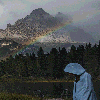

# img to pixel

this is a img to pixel project

## execute command to setup env

```sh
$ pip install -r requirements.txt
```
## fix pixel.py `imgPath` param

```py 
imgPath='picture.png' # img path
```


## execute command to run python

```sh
$ python pixel.py
```

## confirm output picture in output folder

```
output
  |--- picture.png
```


